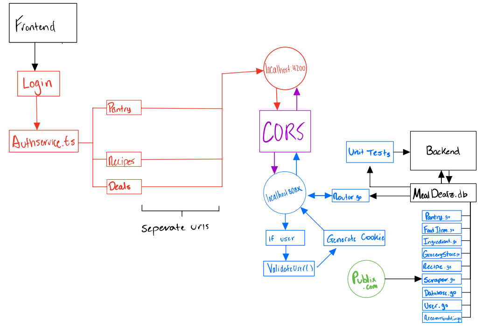

# Sprint 4

## Overall Successes 
- [#235](https://github.com/TylerMetz/Saucier720/issues/235) - Cookie generation 

## Backend Successes
- [#206](https://github.com/TylerMetz/Saucier720/issues/206) - Update database after a POST request
- [#207](https://github.com/TylerMetz/Saucier720/issues/207) - Fixed the minor issues of scraping into the database
- [#228](https://github.com/TylerMetz/Saucier720/issues/228) - Current deals sorting 
- [#241](https://github.com/TylerMetz/Saucier720/issues/241) - Backend authentification service
- [#244](https://github.com/TylerMetz/Saucier720/issues/244) - Backend Reorganization 
- [#279](https://github.com/TylerMetz/Saucier720/issues/279) - Fix Scraper Time Function
- [#301](https://github.com/TylerMetz/Saucier720/issues/301) - Unnecessary data in recipes
## Frontend Successes

## Backend Failures 

## Frontend Failures 

## Backend Unit Testing (For new Sprint 4 functionalities)

## Frontend Unit Testing (For new Sprint 4 functionalities)
- We are using to conduct our frontend unit tests

### Component Testing
- Our component tests in cypress are

### End to End Testing
- Our end to end tests in cypress are

## Backend API Documentation 

  
## Functioning API Flowchart

